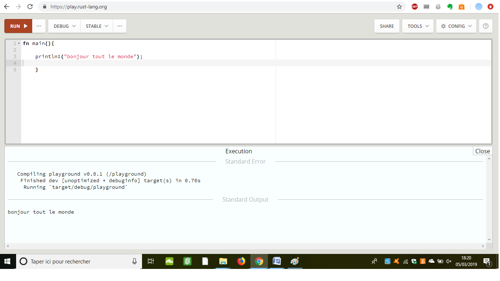
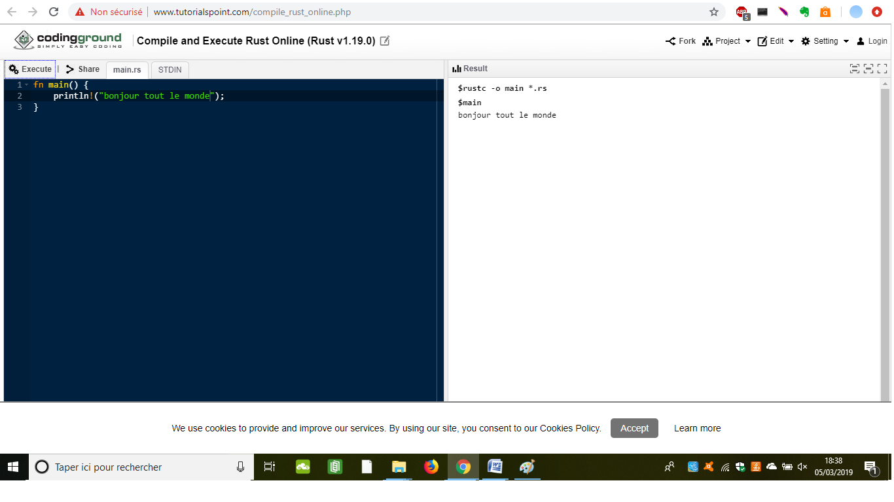
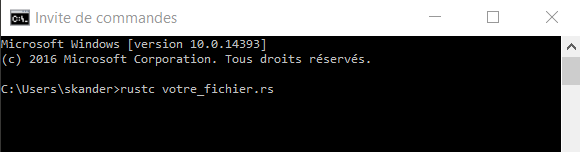
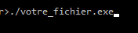

[**Base du langage**](https://UVSQ21917829.github.io/RUST-1)-----[**Concepts avancés**](https://UVSQ21917829.github.io/RUST-1/concept)-----[**Bibliothèques standards**](https://UVSQ21917829.github.io/RUST-1/std)-----[**Bibliothèques tierces**](https://UVSQ21917829.github.io/RUST-1/trc)-----[**Ressources d'apprentissages**](https://UVSQ21917829.github.io/RUST-1/rsc)-----[**Exercices d'apprentissages**](https://UVSQ21917829.github.io/RUST-1/exo)   


## Outils de développement 

Pour pouvoir développer sur Rust , il va falloir utiliser le bon outils , RUST à un éditeur de code [**play.rust-lang.org**](https://play.rust-lang.org/)




  Soit [ce lien](http://www.tutorialspoint.com/compile_rust_online.php)
qui permet d'éditer, compiler et exécuter des projets complets (répartis sur plusieurs fichiers) tout en proposant des outils d'import et d'export.




Si vous n’utilisez pas l’éditeur en ligne .

Après avoir créer votre fichier.rs sur sublime text ou autre avec le compilateur installer vous n’avez plus compilé le fichier comme ceci :




  
  
## Le compilateur de Rust
Si vous ne souhaitez pas utiliser l'éditeur Rust en ligne, il va vous falloir télécharger le compilateur de Rust disponible [ici](https://www.rust-lang.org/), puis l'installer.

## Tests Unitaires
  Pour faire des tests unitaires en rust il suffit d'ajouter #[test] sur la ligne avant la fonction de test,la fonction ne doit prendre aucun argument en paramétre et ne rien renvoyer.
  Les fonctions check, fail, assert (ainsi que assert_eq, assert_approx_eq, etc) sont très utiles pour les tests unitaires.
  
### Exemple:
 
  ```markdown
  fn somme(x: i32,y :i32)->i32{
                              x+y
                              }
  #[test]
  fn test_somme() {
                  assert_eq!(3,somme(1,2));
                  }
  ```
  
  Si on souhaite que la fonction échoue, il faut mettre en plus #[should_fail].
 
### Exemple:

  ```markdown
  #[test]
  #[should_fail]
  fn test_l’échec() {
                    assert_eq!(4,somme(1,2));
                    }
  ```
  Il existe un type de tests unitaires un peu spécial : les benchmarks (tests de performances). Il faut utiliser l’attribut #[bench] mais aussi un peu plus que ça
  

### Exemple:

 ```markdown 
  #[bench]
fn test_trucmuche(b: &mut extra::test::BenchHarness) { // on va utiliser l’argument
    // le code de préparation
    do b.iter() {
        // le code dont vous souhaitez mesurer les performances
                }
                                                     }
```

## rustdoc

  **rustdoc** est un outil livré avec Rust qui permet de générer de la documentation à partir des commentaires du code.

Pour qu’un commentaire soit considéré comme de la documentation, il faut utiliser une syntaxe spéciale :
```markdown 
 /// Ceci est un commentaire de documentation mono-ligne
/**
 * Ceci est un commentaire de documentation
 * sur plusieurs lignes
 */
 
```
La syntaxe utilisée pour la mise en forme est le Markdown (comme sur Linuxfr), et la version HTML est générée avec Pandoc.

Il y a quelques règles cependant :

  La première phrase d’un commentaire sera prise comme résumé de la suite du commentaire
  Seuls les titres indiqués avec un seul # (et non plusieurs # ou plusieurs = en dessous du texte) sont interprétés par                                                 rustdoc. Cette règle sera assouplie dans le futur.

Il y a également quelques conventions :

La première phrase doit décrire succinctement ce que l’élément fait. Si ça n’est pas suffisant, la suite devra décrire quoi et pourquoi l’élément fait ce qu’il fait, les entrées-sorties, et mentionner sous quelles conditions le code va échouer.

On doit utiliser des titres standards quand le texte devient long : « Arguments », « Return value » (valeur renvoyée), « Failure » (échec), « Example », « Safety notes » (notes sur la sûreté), et « Performance notes » (notes sur la performance). Les arguments doivent être écrit de la façon suivante :
```markdown 
# Arguments

* `arg1` - pour faire tel truc
* `arg2` - pour connaitre telle chose

```


Les autres façons d’écrire du code en Markdown ne fonctionnent pas () ou sont ambigües (quatre espaces devant le code) et peuvent donc ne pas fonctionner.

Pour générer la documentation, rien de plus simple : il suffit d’ajouter #[link(name = "Nom de votre projet")] en en-tête de votre fichier main.rs (ou le fichier principal de votre projet) et d’utiliser la commande rustdoc main.rs. Cela vous donnera une documentation au format HTML.

Mais on peut fournir bien plus d’informations… Je vous laisse jeter un coup d’œil à la configuration utilisée dans la bibliothèque standard de Rust :
```markdown 
#[link(name = "std",
vers = "0.9-pre",
uuid = "c70c24a7-5551-4f73-8e37-380b11d80be8",
url = "https://github.com/mozilla/rust/tree/master/src/libstd")];

#[comment = "The Rust standard library"];
#[license = "MIT/ASL2"];
#[crate_type = "lib"];

#[doc(html_logo_url = "http://www.rust-lang.org/logos/rust-logo-128x128-blk.png",
html_favicon_url = "http://www.rust-lang.org/favicon.ico",
html_root_url = "http://static.rust-lang.org/doc/master")];

```
 
 
 
## rustpkg
 
 **rustpkg** est un outil qui permet de faire des paquets Rust, largement inspiré du gestionnaire de paquets de Go. On peut donner des informations à cet outil grâce aux attributs (par exemple, #[licence = "ma_licence"] et #[link(vers = "mon_numéro_de_version")]).

Un espace de travail valide contient les dossiers suivants :


   
  src/, qui contient un dossier par paquet (ex : src/foo/main.rs) ;
  
   lib/, rustpkg install va y installer les bibliothèques nécessaires dans un sous-dossier 
    (ex : si libbar est nécessaire à foo,alors elle sera installée à lib/x86_64-apple-darwin/libbar-[hash].dylib) ;
    
   bin/, pour les exécutables (ex : bin/foo) ;
    
   build/, rustpkg build va y stocker les fichiers temporaires de compilation (ex : build/x86_64-apple-darwin/foo/main.o).


L’ID d’un paquet prend la forme d’une URL (par exemple, github.com/mozilla/rust si c’est un dépôt distant ou /foo/bar/ si c’est un dépôt local). Une version peut être précisée :

   Un tag (ex : github.com/mozilla/rust#0.3). Dans ce cas, rustpkg va vérifier que le dépôt contient bien un tag nommé 0.3 ;
    Une révision particulière (ex : github.com/mozilla/rust#release-0.7). Comme ça n’est pas un nombre décimal, rustpkg passe la refspec (ce qu’il y a après le #) au système de gestion de version sans l’interpréter. Cela compte comme un ID de paquet à part entière, là où une nouvelle version peut satisfaire la dépendance envers une ancienne version ;
    Une révision particulière (ex : github.com/mozilla/rust#5c4cd30f80). La _refspec est également passée directement au système de gestion de version.

Une fois bien paramétré, on a accès aux commandes rustpkg build, rustpkg clean, rustpkg install, et rustpkg test. Autant dire que ça automatise pas mal de choses !

## Cargo :

Cargo est le gestionnaire de colis Rust . Cargo télécharge les dépendances de votre paquet Rust, compile vos paquets, crée des paquets distribuables et les télécharge sur [crates.io](https://crates.io/) , le registre de paquets de la communauté Rust . 

  
  Commençons par le fichier **Cargo.toml**, ajoutez ces deux lignes :
```markdown 
[dependencies]
time = "0.1"
```

Nous avons donc ajouté une dépendance vers la bibliothèque time. Maintenant dans votre fichier principal (celui que vous avez indiqué à Cargo), ajoutez :
```markdown 
extern crate time;
```

Pour appeler une fonction depuis la bibliothèque, il suffit de faire :

```markdown 
println!("{:?}", time::now());
```

Et c'est tout ! Les imports fonctionnent de la même façon :

```markdown
use time::Tm;
```
